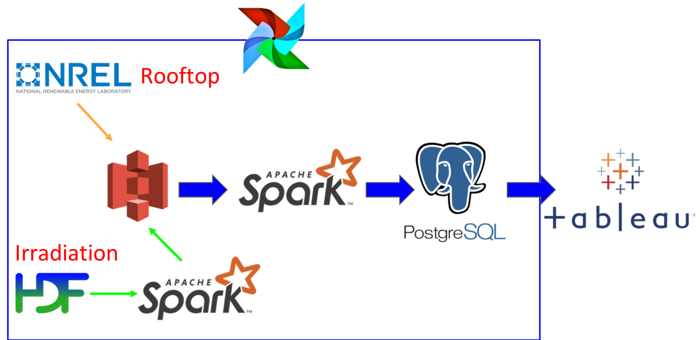

# Solar Power Marketing 
This project is to build up a pipeline to analyze urban solar power market in US, coupling with PV (Photovoltaic) rooftop database and solar radiation database from NREL (National Renewable Energy Laboratory) data source stored in AWS.

# Table of Contents

1. [Overview](README.md#overview)
2. [Requirements](README.md#requirements)
3. [Installation](README.md#installation)
4. [Getting Started](README.md#getting-started)
5. [Credits](README.md#credits)

# Overview
Solar Power is renewable and clean for the earth. The urban solar market potential in US is booming and and it is expected to reach to $22.9 billions by 2025. Therefore, analyzing the solar power market over the US is important for solar industries. However, not all rooftops can build up solar panels, which can lead to an overestimate of residential solar power market in US. Here, utilizing the PV rooftops, which are able to build up at least one solar panels, and the solar radiation databases, this project will provide an acurate estimate of urban solar power market and explore the regions in US with most potential solar power market in a zip code level.

Features:
- 2005-2014 PV rooftop database (100GB)
- 2005-2014 solar radiation database (15TB)
- Explore zip code level urban solar power market size in US

Solar-power-marketing is scalable and built on Amazon S3, EC2, Apache Spark, PostgreSQL on AWS. Airflow is used to schedule and monitor the workflow of the ETL. Tableau can be used to visualize and analyze the standardized dataset.

[Slides](https://drive.google.com/open?id=1QFfqpmwcNVOsM8dnTihsSDQ28R_BQJEHRMxpEA28v6w)



# Requirements
## Architecture requirements
* Amazon AWS Account
* Apache Spark: data ingestion and data process
* PostgreSQL: data storage
* Airflow: ETL scheduler and monitor
## Evironment requirements
* Python 3.6: required for h5py
* Python libs: h5py, s3fs, pygeohash, shapely, uszipcode, pgeocode, geohash2

## Environment set up
Install Apache Spark using [Pegasus](https://github.com/InsightDataScience/pegasus)

Install PostgreSQL using [Tutorial](https://blog.insightdatascience.com/simply-install-postgresql-58c1e4ebf252)

Install Airflow

```bash
$ export AIRFLOW_HOME=~/airflow
$ sudo apt install python3.6-dev
$ pip install apache-airflow
$ airflow initdb
$ airflow webserver -p 5050
```

Install python 3.6 

```bash
$ sudo apt-get install software-properties-common
$ sudo add-apt-repository ppa:deadsnakes/ppa 
$ sudo apt-get update
$ sudo apt-get install python3.6
```

Set python 3.6 as default python

```bash
$ sudo update-alternatives --install /usr/bin/python python /usr/bin/python3.6 1
```

Update pip

```bash
$ sudo pip install --upgrade pip
```

Install s3fs

```bash
$ pip install awscli --upgrade –user
$ pip install boto3
$ pip install s3fs
```

Install h5py

```bash
$ sudo pip install cython
$ sudo apt-get install libhdf5-dev
$ sudo pip install h5py
```

# Installation
Clone the Solar-power-marketing project to your local computer or `m4.large` EC2 instance and install the requirements.

```bash
$ git clone https://github.com/caixiuhong/solar-power-marketing.git
```

## Use bash for ingestion and process
Ingest solar radiation data into S3 bucket, using Spark.

```bash
$ ./src/spark/submit-ingest.sh
```

Process PV rooftop data and solar radiation data using Spark, and save results in PostgreSQL.

```bash
$ ./src/spark/submit-process.sh
```

## Or use Airflow to schedule and monitor ingestion and process 
```bash
$ airflow scheduler
```
Then trigger the solar_power_marketing_dag.

# Getting Started

Front end is at the website: [http://www.datagourmet.xyz](http://www.datagourmet.xyz). 

Three graphs are shown in the interactive dashboard. On the top is the market size of solar power in chosen year over the states in US. Bottom left shows the cities that have most solar power markets for the whole nation or chosen state. Bottom right shows the zip code region that have most solar power market for the whole nation or chosen state/city. 

# Credits

Solar-Power-Marketing was built as a project at Insight Data Engineering in the Jan 2020 session by Xiuhong Cai. It is availble as open source and is free to use and modify by anyone.
